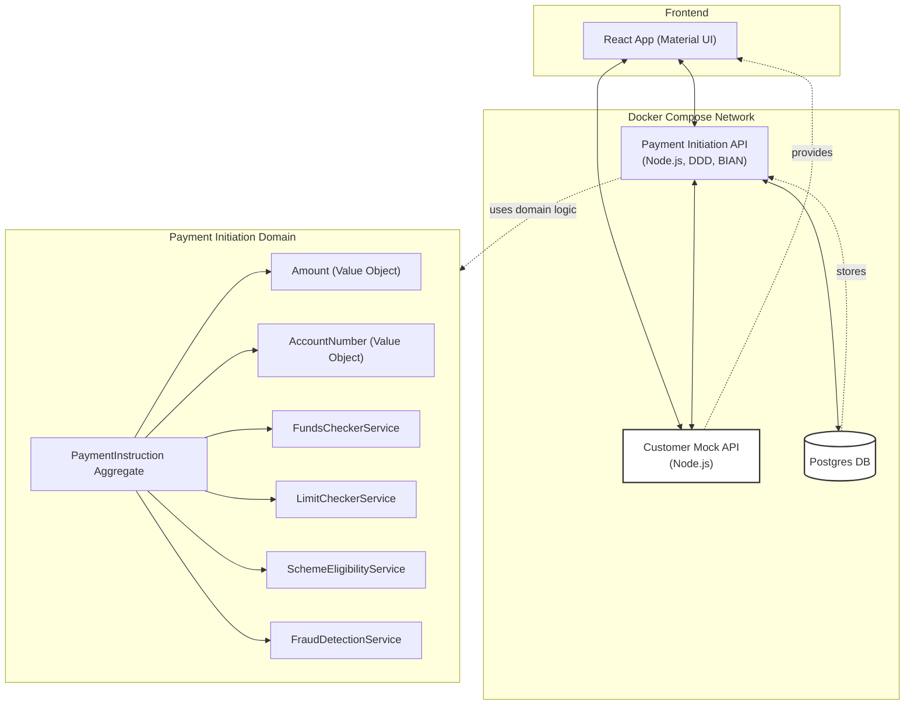

# Payment Initiation App (BIAN/DDD Example)

A full-stack reference implementation for Payment Initiation in a UK retail banking context, following Domain-Driven Design (DDD) and BIAN standards.

## Overview
- **Frontend**: React + Material UI (payment journey UI)
- **Backend**: Node.js/TypeScript, DDD, BIAN-aligned Payment Initiation domain
- **Customer Mock Service**: Node.js/TypeScript, provides customer/account data
- **Database**: Postgres (Dockerized)
- **Orchestration**: Docker Compose

## Architecture



- **Frontend**: Guides user through payment journey (select account, enter details, review, confirm, result)
- **Payment Initiation API**: Handles payment logic, persists instructions
- **Customer Mock API**: Provides mock customer and account data

## Running the App

### Prerequisites
- [Docker](https://www.docker.com/products/docker-desktop) installed

### Start All Services
```sh
docker compose up --build
```
- Frontend: [http://localhost:3000](http://localhost:3000)
- Payment API: [http://localhost:4000/payment-initiations](http://localhost:4000/payment-initiations)
- Customer Mock: [http://localhost:4001](http://localhost:4001)

### Stopping
```sh
docker compose down
```

## API Endpoints (BIAN-aligned)

### Payment Initiation API (`:4000`)
- `POST /payment-initiations` — Initiate a payment (BIAN canonical)
- `GET /payment-initiations` — List all payment initiations
- `GET /payment-initiations/{id}` — Get payment initiation by ID
- `POST /payment-initiations/{id}/execute` — Execute the payment (explicit execution)
- `POST /payment-initiations/{id}/notify` — Notify about payment status

**Payload Example:**
```json
{
  "debtorAccount": { "accountId": "acc1", "accountType": "Current", "iban": "GB00CUST1000000001" },
  "creditorAccount": { "accountId": "acc3", "accountType": "Current", "iban": "GB00CUST2000000001" },
  "amount": 100.00,
  "currency": "GBP",
  "reference": "Invoice 123",
  "requestedExecutionDate": "2024-06-01"
}
```

### Customer Mock API (`:4001`)
- `GET /customers` — List customers
- `GET /customers/:id` — Get customer by ID
- `GET /accounts?customerId=xxx` — List accounts for a customer

## Payment Journey (Frontend)
1. **Select Account** — Choose source account (fetched from mock API)
2. **Enter Payment Details** — Recipient IBAN, account ID, amount, currency, reference, execution date
3. **Review** — Confirm details
4. **Confirm** — Initiate payment (calls BIAN-aligned backend)
5. **Result** — See payment status

## Business Rules Implemented

The following business rules are enforced for every payment initiation:

- **Sufficient Funds:** The debtor account must have enough balance to cover the payment (mocked as £1,000 for all accounts).
- **Single Payment Limit:** No single payment can exceed £500.
- **Daily Payment Limit:** No account can send more than £2,000 per day (mocked, resets per test run).
- **Scheme Eligibility:** Only GBP payments up to £250,000 are eligible for Faster Payments (other currencies are rejected).
- **Fraud Detection:** Payments over £10,000 are flagged as potentially fraudulent and rejected.

If any rule is violated, the API returns a clear error message and the payment is not created.

---

**For demo purposes, the customer is hardcoded as `cust1`.**

Feel free to extend the domain, add authentication, or connect to real banking APIs!